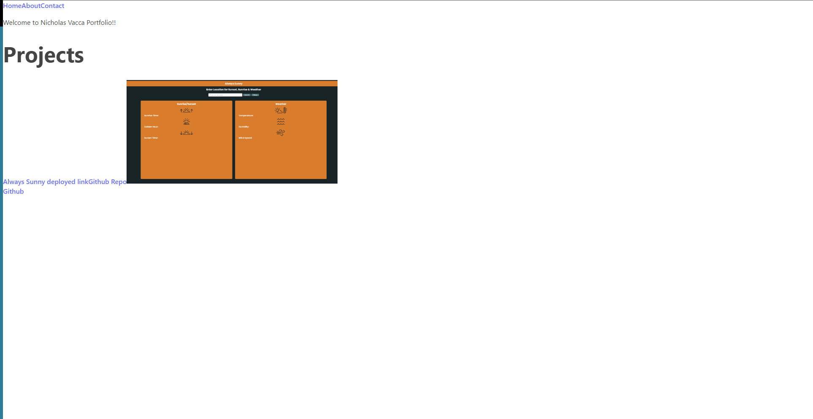

# React_Portfolio

## Description
Welcome to My React Portfolio! This project showcases my skills, projects, and experience using React.

## Prerequisites
Make sure you have Node.js and npm installed on your machine.

Node.js: https://nodejs.org/ 
npm: https://www.npmjs.com/

## Installation

1. Clone the repository:
`git clone` git@github.com:magellanrose/React_Portfolio.git

2. Install dependencies:
`npm install`

3. Run the application:
`npm run dev`

## Technologies Used
- React
- HTML5
- SCSS
- Javascript

## Deployed Link
https://65db9862aeab2e1450084362--heroic-peony-41c18f.netlify.app

## Github Repository
https://github.com/magellanrose/React_Portfolio

## Mock Up

## License
MIT  

## Questions
Github: https://github.com/magellanrose 
Email: nicholasfvacca@gmail.com
